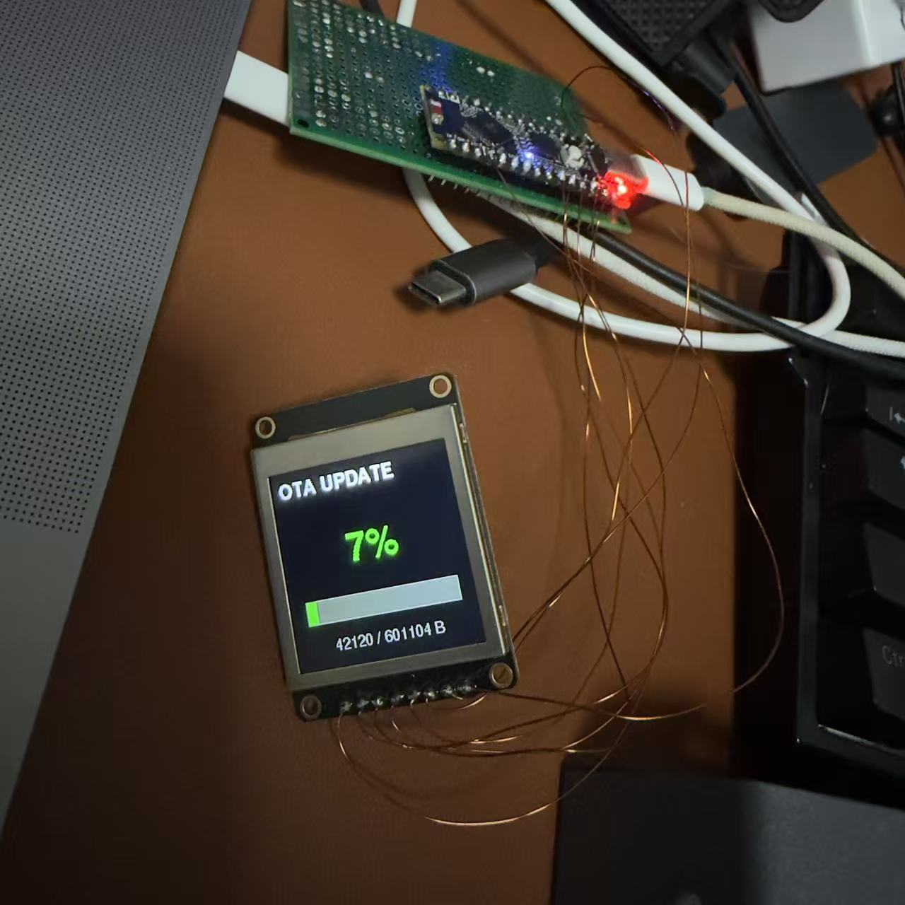
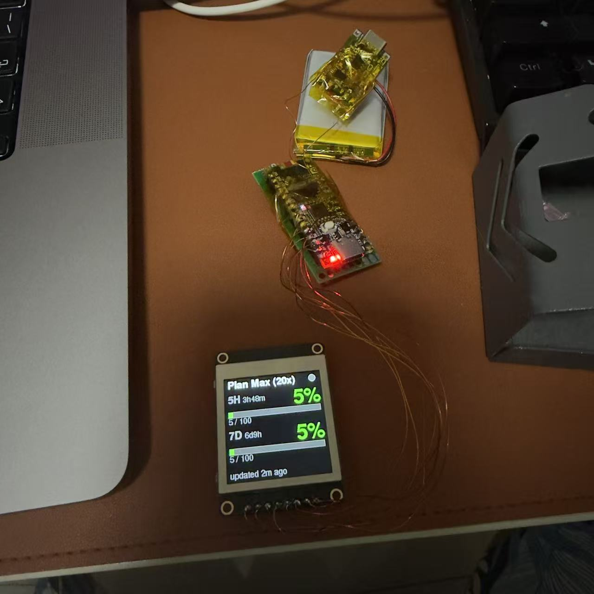

# cc_hud

A small desktop hardware HUD that mirrors Claude Code's rate-limit usage
(5-hour + 7-day) or API session cost on a 1.54" colour LCD, driven by an
ESP32-S3 and updated over Bluetooth Low Energy from a wrapper plugged into
your Claude Code statusline.

<p align="center">
  
  &nbsp;&nbsp;
  
</p>

*Left: live HUD showing the active plan title + 5H/7D usage with reset
countdown. Right: full-screen OTA progress takes over while a new firmware
streams in over BLE — the device reboots into the new image on completion.*

---

## Project at a glance

| Layer | What |
|---|---|
| Hardware | ESP32-S3-Nano (R8, 8 MB Flash + 8 MB OPI PSRAM) + 1.54" 240×240 IPS ST7789 + LiPo 503040 + TP4056 + MT3608 |
| Firmware | PlatformIO · Arduino-ESP32 · **LVGL 9** (all UI) · Adafruit_ST7789 (panel driver + OTA screen) · NimBLE-Arduino · NVS · `Update` library for BLE OTA |
| Host | Python 3.11+ · bleak · shell wrappers for Claude Code statusline + hooks · Python OTA uploader |
| Enclosure | One-piece 3D-printed case + drop-in back cover (+ optional TPU sleeve), parametric build123d sources, Bambu-compatible 3MF |
| BLE protocol | Custom GATT service; quota v1–v3 (subscription 5H/7D + reset countdown + plan title, or API cost + duration), v4 wall-clock/weather push, 0x05–0x07 control messages (force-idle / force-mood / live Claude Code app-state) |
| OTA | Second GATT service streams firmware bytes into the inactive slot; arduino-esp32 `Update` library handles the slot switch + reboot |

---

## Firmware architecture (LVGL 9)

All regular UI renders through LVGL 9; the legacy hand-drawn renderer
(~1300 lines of manual coordinate math + diff caches) was deleted after
the migration proved out on hardware. `display.cpp` keeps only what must
work when LVGL is *not* ticking: panel bring-up and the OTA screen.

```
 BLE callbacks (NimBLE task)                Arduino loop (main.cpp)
┌─────────────────────────────┐            ┌──────────────────────────────┐
│ 0x01–0x03  quota write      │ portMUX-   │ drain shared state           │
│ 0x04       wall-clock/wx    │ guarded    │ derive idle / mood / state   │
│ 0x05       force-idle       │ globals    │ build LvglUiModel            │
│ 0x06       force-mood       │ ─────────► │ lvglUiApply(model)  ← diffs  │
│ 0x07       Claude app-state │            │ lv_timer_handler()           │
└─────────────────────────────┘            └──────────────┬───────────────┘
                                                          │ partial render
                                           ┌──────────────▼───────────────┐
                                           │ LVGL 9                       │
                                           │ 2 × 40-row SRAM draw buffers │
                                           │ (no PSRAM dependency)        │
                                           │ flush_cb                     │
                                           └──────────────┬───────────────┘
                                                          │ drawRGBBitmap
                                           ┌──────────────▼───────────────┐
                                           │ Adafruit_ST7789 · SPI 40 MHz │
                                           └──────────────────────────────┘
```

Design decisions:

- **`main.cpp` is the single data owner.** BLE callbacks only stash
  values into portMUX-guarded globals. Once per loop, `main` drains
  them, derives idle mode / pet mood / app state, and hands one
  `LvglUiModel` to `lvglUiApply()`. The apply function diffs every
  field against what's already on screen, so a no-change tick costs a
  few `strcmp`s — no LVGL invalidation happens unless a value moved.
- **Two screens, fade transition.** HUD (plan title, BLE dot, 5H/7D
  bars with green/yellow/red tiers, used/limit + live reset countdown,
  API-cost variant, freshness footer, brand logo, app-state slot) and
  IDLE (mood-reactive walking ASCII pet, Montserrat-48 clock, date,
  weather status). `lv_screen_load_anim` fades between them.
- **App-state slot** (footer right, 40×40): thinking → 8-frame
  splatter GIF via `lv_animimg`; tool → one of 10 icons picked by
  longest-prefix match on the tool name (`mcp__*` catch-all);
  waiting → pulsing dot via `lv_anim`; idle → three dim dots. Driven
  live by Claude Code hooks (`host/cchud-hook.sh`, msg_type 0x07).
- **No PSRAM needed.** This board's OPI PSRAM is disabled (boot-loop
  issues on the clone), so LVGL runs in `RENDER_MODE_PARTIAL` with two
  static 19.2 KB SRAM buffers. Pixels go out through Adafruit's
  `drawRGBBitmap` — native-endian RGB565, no byte swap.
- **Assets cost zero extra flash.** The brand logo (40×40), 10 tool
  icons (40×40) and 8 thinking-GIF frames (40×40) are the same RGB565
  arrays the legacy renderer used, wrapped in `lv_image_dsc_t` at init.
  Regeneration tooling lives in `firmware/tools/` (`slice_icons.py`,
  `gif_to_buffer.py`, `generate_star_frames.py`).
- **Fonts**: Montserrat 14/18/20/24/48 (built-in, enabled in
  `firmware/include/lv_conf.h`) + `font_cn_20.c`, a generated 20 px CJK
  subset (full ASCII + °℃℉ + 136 chars covering WWO weather phrases and
  major Chinese city names) so the idle weather line renders Chinese.
  Regenerate with `lv_font_conv` when the glyph set needs to grow.
- **Alert without blocking.** The ≥95 % usage flash is an `lv_anim`
  opacity pulse on a top-layer overlay (the legacy version blocked the
  main loop for 5 s).
- **OTA screen stays out of LVGL.** While firmware streams in, the BLE
  OTA task draws its progress bar directly via Adafruit calls and the
  main loop stops pumping `lv_timer_handler()` (gated on
  `displayIsOtaActive()`). The device reboots on completion, so the two
  render paths never fight.

Resource usage: ~1.1 MB flash (34 % of the 3 MB OTA slot), ~131 KB RAM
(40 %, includes LVGL's 48 KB heap + both draw buffers).

---

## Bill of materials

| # | Part | Spec | Approx ¥ |
|---|---|---|---|
| 1 | ESP32-S3 main board | ESP32-S3R8 in Arduino Nano ESP32 footprint, 8 MB Flash | 35 |
| 2 | LCD module | 1.54" IPS ST7789 240×240, 4-wire SPI, 8-pin | 22 |
| 3 | LiPo battery | 503040 600 mAh (5 × 30 × 40 mm) with protection PCB | 15 |
| 4 | Charge IC module | TP4056 with USB-C input + DW01 protection | 3 |
| 5 | Boost converter | MT3608 (LiPo 3.7 V → 5 V, adjustable) | 4 |
| 6 | Slide switch | SS-12D00 (8.5 × 4 × 4 mm, side-mount) | 1 |
| 7 | Dupont / silicone wire | 30 cm of 0.5 mm² × 4 colours | 3 |
| 8 | Filament | ~25 g PETG (or PLA) for the case + cover | — |
| | | **Total** | **~¥83** |

---

## Wiring

### Display ↔ ESP32-S3 main board

The board exposes Arduino-Nano-style silkscreen pins; the GPIO numbers below
are the actual ESP32-S3 pads the firmware uses in `firmware/src/config.h`.

| LCD pad | Signal | → | Board pad | ESP32-S3 GPIO |
|---|---|---|---|---|
| GND | Ground | → | GND | — |
| VCC | +3.3 V (⚠ NOT 5 V) | → | 3V3 | — |
| SCL | SPI clock | → | D13 | GPIO48 |
| SDA | SPI MOSI | → | D11 | GPIO38 |
| RST | Reset | → | D8 | GPIO17 |
| DC | Data/Command | → | D7 | GPIO10 |
| SC (= CS) | Chip select | → | D10 | GPIO21 |
| BL | Backlight | → | D9 | GPIO18 |

If yours says `CS` instead of `SC`, same thing. MISO is unused (the LCD is
write-only) — leave it disconnected.

### Power supply chain (battery + charge + boost)

The TP4056 output is unregulated 3.0–4.2 V LiPo voltage, which is **out of
spec for the ESP32-S3's 3V3 rail**. The MT3608 boosts it back to a stable
5 V that the on-board regulator on the ESP32-S3 board can step down again.

```
       USB-C 5 V                                              ESP32-S3 board
       (TP4056 input)                                              VBUS  ◄──┐
            │                                                                │
            ▼                                                                │
       ┌────────────┐        ┌──────────┐       ┌──────────┐                 │
       │  TP4056    │  OUT+  │  Slide   │  IN+  │  MT3608  │  OUT+ (5.0 V) ──┘
       │  charger   │───────►│  switch  │──────►│  boost   │
       │  +protect  │  OUT-  │  SS-12D00│  IN-  │  3.7→5V  │  OUT-  ─────────►  GND
       └──┬─────┬───┘        └──────────┘       └──────────┘
          │ B+  │ B-
          ▼     ▼
       LiPo + / LiPo -   (503040 600 mAh)
```

Step-by-step solder list:

| Step | From | To | Wire colour |
|---|---|---|---|
| 1 | LiPo + | TP4056 **B+** | red |
| 2 | LiPo − | TP4056 **B−** | black |
| 3 | TP4056 **OUT+** | slide switch centre pin | red |
| 4 | Switch side pin (either) | MT3608 **IN+** | red |
| 5 | TP4056 **OUT−** | MT3608 **IN−** | black |
| 6 | MT3608 **OUT+** | ESP32 board **VBUS** | red |
| 7 | MT3608 **OUT−** | ESP32 board **GND** | black |

**⚠ Before step 6**: plug the LiPo, slide switch ON, multimeter the MT3608
output, rotate the small blue trimmer until it reads **5.0 V ± 0.1 V**.
Connecting an un-trimmed MT3608 can output 12 V and kill the ESP32-S3.

Charging works automatically: plug USB-C into the TP4056 module's input
(USB-C if your module has one, otherwise solder a USB-C breakout to IN+/IN-).
Red LED = charging, blue LED = charged.

**Do not** power the ESP32 board through its own USB-C *and* the boost
output at the same time — back-feeding. Either flip the slide switch OFF
while debugging over USB, or fit a dual-input OR'ing module (e.g. LM66100)
in a v2 build.

---

## Enclosure

Two STL/3MF parts, both parametric (`*.py` sources in repo root):

| File | What | Outer size |
|---|---|---|
| `cc_hud_case.3mf` | Main shell — front panel + screen window + header-pin relief pocket + **top-wall USB-C cut-out** + feet | 40 × 58 × 45 mm |
| `cc_hud_back_cover.3mf` | Drop-in lip-jointed back cover **with TP4056 pocket** + pry-open notches | 40 × 58 × 5 mm |

Screen is **portrait** — long edge along Y. Active area 33 × 35 mm,
screen module PCB 34 × 44 mm.

There are **no standoffs**. The screen PCB sits flush against the
front panel (the active glass embeds inside the 2.7 mm panel cut-out);
the ESP32 board rides directly behind the screen PCB. Use 5 × 5 mm
double-sided foam tape (or a dab of hot glue) at the corners to lock
both PCBs in place.

The inner face of the front panel has a 30 × 5 × 1.5 mm relief pocket
along the bottom edge of the screen PCB. That's where the screen
module's header-pin solder joints sit; the pocket lets the PCB seat
fully against the panel instead of being held off by the joints.

The **TP4056 charging module** drops into a 25.5 × 18.5 × 3.5 mm
pocket in the back cover. The module's USB-C connector then aligns
with the case's top-wall cut-out — plug the charger into the top of
the case and the lead runs straight into the module mounted in the
back cover. (Module spec: standard TP4056 USB-C with DW01 protection,
~25 × 18 × 3.5 mm. Adjust `TP4056_W`/`H`/`T` in the .py if yours is
different.)

Internal layout (Z = depth, front panel at Z=0):

| Z range | Layer |
|---|---|
| 0 – 2 mm | Front panel |
| 2 – 6.2 mm | Screen module (active + PCB, 4.2 mm combined) |
| 6.2 – 7.6 mm | Wire gap behind the screen PCB (tight, 1.4 mm) |
| 7.6 – 9.2 mm | ESP32-S3 board PCB |
| 9.2 – ~14 mm | ESP32 components + USB-C body |
| ~14 – ~19 mm | LiPo cell (35 × 52 × ~5 mm) |
| ~19 – 53 mm | TP4056 + MT3608 + slide switch + cabling (~34 mm slack) |
| 53 – 55 mm | Back cover lip |

To regenerate after editing a parameter:

```bash
# Main case
PYTHONPATH=~/.claude/skills/cad/scripts python3 -m step \
    cc_hud_case.py --stl cc_hud_case.stl --skip-explorer
python3 ~/.claude/skills/bambu-3mf/scripts/stl_to_3mf.py \
    cc_hud_case.stl cc_hud_case.3mf

# Back cover (same recipe)
PYTHONPATH=~/.claude/skills/cad/scripts python3 -m step \
    cc_hud_back_cover.py --stl cc_hud_back_cover.stl --skip-explorer
python3 ~/.claude/skills/bambu-3mf/scripts/stl_to_3mf.py \
    cc_hud_back_cover.stl cc_hud_back_cover.3mf
```

Print orientation:

- **Main case**: front panel face down (screen window touching build plate).
  Open back faces up. No supports needed.
- **Back cover**: backplate face down, lip pointing up. No supports.

Recommended: PETG, 0.2 mm layer, 20 % gyroid infill, 3–4 walls.

---

## Software setup

### 1. Flash the firmware (one time, over USB)

```bash
cd firmware
pio run -t upload
```

If the chip is stuck in a boot loop and the USB CDC keeps disappearing,
use the 1200-baud rescue trick documented in
`docs/esp32s3-flash-recovery.md` (`stty -f /dev/cu.usbmodemXXXX 1200`
then `esptool ... --before no-reset write-flash ...`).

### 2. Set up the host environment

```bash
cd host
uv venv .venv
uv pip install -r requirements.txt
```

### 3. Find the device address (one time)

```bash
.venv/bin/python push_quota.py --discover --verbose --timeout 8
# Save the printed UUID (macOS) or MAC (Linux/Win) — used as --address below
```

### 4. Push some test data

```bash
.venv/bin/python push_quota.py \
    --address <YOUR_DEVICE_UUID> \
    --5h-used 45 --5h-limit 100 \
    --7d-used 230 --7d-limit 500 \
    --title "Plan Max (20x)" \
    --verbose
```

### 5. Wire into Claude Code statusline (automatic updates)

The `host/cchud-update.sh` wrapper is rate-limited (30 s by default) and
forks the BLE push into the background, so it's safe to call from the
statusline command (which fires every few seconds). Paste this near the
end of your `~/.claude/statusline.sh`:

```bash
CCHUD="$HOME/Desktop/work/cc_hud/host/cchud-update.sh"
if [ -x "$CCHUD" ]; then
    CCHUD_ADDR=<YOUR_DEVICE_UUID> \
    CCHUD_TITLE="Plan Max (20x)" \
    CCHUD_MODE=sub \
    "$CCHUD" "${FIVE_H_INT:-0}" 100 "${SEVEN_D_INT:-0}" 100 \
            "$CC_5H_RESET_S" "$CC_7D_RESET_S" \
            >/dev/null 2>&1 || true
fi
```

For API-mode users (no `rate_limits` in the statusline JSON), the wrapper
also accepts `CCHUD_MODE=api`, `CCHUD_COST_USD`, `CCHUD_DURATION_S`.

Two optional extras:

- **Idle weather** — export `CCHUD_WEATHER_CITY=北京` (any wttr.in
  location; Chinese names render natively) and the statusline piggy-back
  (`cchud-idle.sh`, rate-limited to 10 min) keeps the idle screen's
  clock calibrated and its weather line fresh, e.g. `多云 +16°C 北京`.
- **Live app-state mirroring** — merge `host/settings.hooks.example.json`
  into `~/.claude/settings.json`. Five Claude Code hooks
  (UserPromptSubmit / PreToolUse / PostToolUse / Stop / Notification)
  call `cchud-hook.sh`, which dedups and BLE-pushes msg_type 0x07 — the
  footer slot then shows what Claude is doing in real time (thinking
  GIF, per-tool icon, waiting pulse, idle dots). The hook holds a
  single-flight `mkdir` lock so rapid tool chains can't race the one
  CoreBluetooth connection macOS allows.

### 6. OTA upgrade (no more USB)

After the first USB flash, every subsequent firmware update goes over
Bluetooth:

```bash
.venv/bin/python ota.py \
    --address <YOUR_DEVICE_UUID> \
    --firmware ../firmware/.pio/build/esp32s3_nano/firmware.bin \
    --verbose
```

Takes ~3 minutes for a 600 KB image. The screen flips to a full-screen
"OTA UPDATE N%" + progress bar while the upload is happening, and the
device reboots into the new firmware on the END command.

---

## BLE protocol

Service UUID: `12345678-aaaa-bbbb-cccc-1234567890ab`

| Characteristic | UUID | Properties | Purpose |
|---|---|---|---|
| Quota | `…0a1` | Write / WriteNoResp | All message types below |
| State | `…0a2` | Read / Notify | ACK / error feedback for each write |

Message types on the Quota characteristic (first byte routes):

| Type | Payload | Meaning | Host CLI |
|---|---|---|---|
| `0x01`–`0x02` | 9 / 17 B | Legacy quota (used/limit, + reset countdowns) | `push_quota.py` |
| `0x03` | 27 B + title | Quota v3: mode (sub/api), cost, duration, plan title | `push_quota.py` |
| `0x04` | 8 B + status | Wall-clock (unix + tz) + UTF-8 weather/status string for the idle screen | `push_idle.py` |
| `0x05` | 2 B | Force-idle latch on/off (preview the clock screen) | `force_idle.py` |
| `0x06` | 2 B | Force pet mood 0–4 / auto | `demo_moods.py` |
| `0x07` | 3 B + tool name | Live Claude Code app-state: idle / thinking / tool / waiting | `push_state.py` via `cchud-hook.sh` |

OTA service: `12345678-aaaa-bbbb-cccc-1234567890bb`

| Characteristic | UUID | Properties | Purpose |
|---|---|---|---|
| Control | `…0b1` | Write | `0x00` START + size, `0x01` END, `0x02` ABORT |
| Data | `…0b2` | Write / WriteNoResp | Firmware byte stream |
| State | `…0b3` | Read / Notify | `READY` / `PROG N` / `OK` / `ERR …` |

⚠ **macOS quirk**: bleak's CoreBluetooth backend silently drops
`response=False` writes once an internal queue fills. Both `push_quota.py`
and `ota.py` force `response=True` for the data characteristics. Don't
revert that.

---

## File layout

```
cc_hud/
├── README.md                       this file
├── cc_hud_case.py / .3mf / .step   main shell (parametric build123d + exports)
├── cc_hud_back_cover.py/.3mf/.step back cover with TP4056 pocket
├── cc_hud_tpu_sleeve.py/.3mf/.step optional slip-on TPU bumper (logo cut-outs)
├── firmware/                       PlatformIO project (Arduino-ESP32)
│   ├── platformio.ini
│   ├── partitions_ota_8mb.csv      dual-app OTA partition table
│   ├── include/lv_conf.h           LVGL 9 config (fonts, buffers, refresh)
│   ├── tools/                      asset pipelines
│   │   ├── slice_icons.py          icon grid PNG → 40×40 RGB565 header
│   │   ├── gif_to_buffer.py        any animated GIF → frame header
│   │   └── generate_star_frames.py programmatic splatter-star frames
│   └── src/
│       ├── main.cpp                data owner: BLE flags → LvglUiModel
│       ├── lvgl_ui.{h,cpp}         all UI: HUD + idle screens, state slot
│       ├── display.{h,cpp}         panel init + OTA screen (non-LVGL)
│       ├── ble_server.{h,cpp}      GATT server, msg-type routing
│       ├── ota_server.{h,cpp}      BLE OTA service → Update library
│       ├── persistence.{h,cpp}     NVS save/restore of the last snapshot
│       ├── config.h                pins, UUIDs, enums, thresholds
│       ├── font_cn_20.c            generated 20 px CJK font subset
│       ├── tool_icons.h            generated tool icons + name→icon map
│       ├── logo_brand.h            generated brand logo
│       └── claude_star_frames.h    generated thinking-GIF frames
└── host/                           Python push/OTA tooling
    ├── push_quota.py               quota push CLI (0x01–0x03)
    ├── push_idle.py                clock + Chinese weather push (0x04)
    ├── push_state.py               app-state push (0x07)
    ├── force_idle.py               idle-screen preview toggle (0x05)
    ├── demo_moods.py               pet mood cycler (0x06)
    ├── ota.py                      OTA firmware uploader
    ├── cchud-update.sh             statusline wrapper (rate-limited)
    ├── cchud-idle.sh               weather/clock wrapper (rate-limited)
    ├── cchud-hook.sh               Claude Code hooks → 0x07 (single-flight lock)
    ├── settings.hooks.example.json drop-in hooks config for ~/.claude/settings.json
    ├── com.cchud.push.plist        launchd template (optional alternative)
    └── requirements.txt
```

`docs/` is gitignored (Claude private workspace).

---

## Final assembly

Step order:

1. Print both 3MFs (PETG, ~25 g, ~1 h).
2. Solder the LCD ↔ ESP32 board per the table above.
3. Flash the firmware once over USB.
4. Set up the host venv + discover the device's BLE address.
5. Solder the power chain (LiPo → TP4056 → switch → MT3608 → ESP32),
   trim MT3608 to 5.0 V before connecting the ESP32.
6. Slide PCBs into the case from the back:
   - Screen PCB sits flush against the front panel, retained by the
     four corner hooks.
   - ESP32 board rests on the four standoffs, USB-C aligned with the
     top cut-out.
7. Tuck the battery + charge module + boost module + switch into the
   remaining cavity.
8. Snap on the back cover (lip joint, friction fit, two notches at the
   bottom for fingernail removal).
9. Wire the statusline hook (`~/.claude/statusline.sh`) — usage shows
   up on the LCD within 30 seconds.

---

## License

MIT
