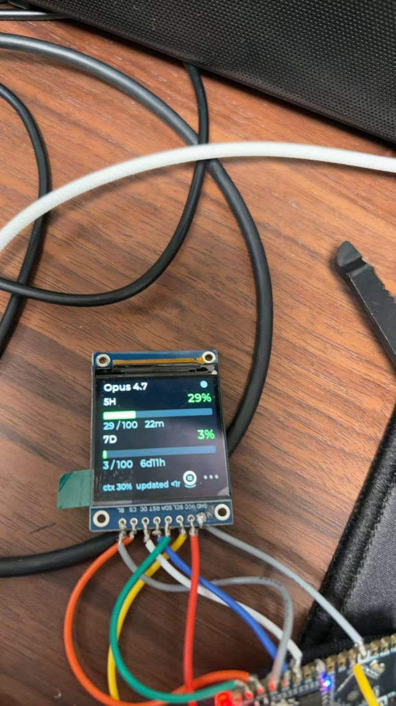
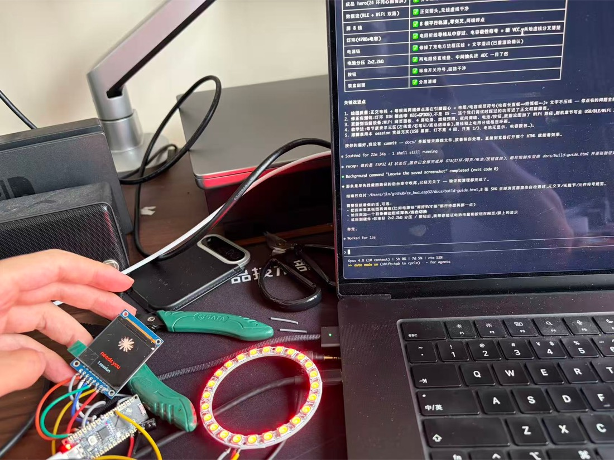

# cc_hud · AI 状态灯

放在桌上的一个小硬件 HUD：一块 1.54″ 彩屏显示 **Claude Code / Codex 的额度、花费、上下文、状态**，外圈 24 颗灯随 AI "在干嘛"红黄绿变化。ESP32-S3 驱动，电脑通过蓝牙/WiFi 把状态推给它。

> 本仓库是 [`uk0/cc_hud_esp32`](https://github.com/uk0/cc_hud_esp32) 的私有 fork，在原版"BLE 推额度 + LCD HUD"基础上做了大量产品级增强（见下）。英文原版说明见 [`README.en.md`](README.en.md)。

<p align="center">
  
  &nbsp;&nbsp;
  
</p>

<p align="center"><em>左：屏幕实时显示 5H/7D 额度 + 重置倒计时 + 上下文用量。右：屏 + 24 颗 WS2812B 状态灯环。</em></p>

---

## 🔱 本 fork 新增功能

**显示 / UI**
- **4 屏轮播状态机**：额度页 / 统计页（成本·时长·增删行·5H 重置倒计时）/ 工具页（大图标 + N 会话·M 忙）/ 时钟页；空闲自动轮播、干活锁工具页、防抖
- **燃烧率耗尽预测**：按当前用速预测"X 窗口会在重置前耗尽" → footer 红字预警
- 更大字号 HUD + CJK 中文天气

**24 灯环状态灯（WS2812B，`firmware/src/led_ring.*`）**
- 空闲 = 绿色**额度表**（点亮颗数 = 额度%、分级变色）
- 工作 = 黄色**彗星** · 等权限 = 红色**整环闪** · 低电 = 橙色慢闪
- **Codex 完成绿脉冲**：AI 答完一轮闪三下

**无线 / OTA / 网页（`firmware/src/wifi_ota.*`）**
- **WiFi OTA**：`cc-hud.local` 局域网秒级刷机（BLE OTA 保留作救砖）
- **网页面板** `http://cc-hud.local/`：实时额度/成本/状态/电量，**亮度滑块（存 NVS、免重刷）**、翻页/调暗遥控、固件版本/运行时长/内存
- **NTP 自动校时**：WiFi 在线自动授时，断电后免手动校准

**智能 / 省电**
- 夜间(23:00–07:00)+ 长空闲自动调暗、空闲 10 分钟熄灯环
- 修复 USB-CDC-on-boot 导致的"插电脑屏黑"（`displayInit` 前移）

**多 AI 工具支持**
- **Codex CLI**：`~/.codex/config.toml` 的 `notify` → 适配器，答完触发灯环绿脉冲；链式调度器保留已有 notify（如 computer-use）
- 任意工具调 `host/push_state.py` 即可推状态；多工具/多会话**统一聚合**（有人忙就显示忙）

**可选硬件（接上即生效，不接不误报）**
- 电池电量监测（2×2.2kΩ 分压 → 丝印 A0）+ 低电告警
- 实体按钮（→ 丝印 A1）短按翻页、长按调暗

---

## 硬件一览

| 部件 | 选型 |
|---|---|
| 主板 | ESP32-S3-Nano（N8R8/N16R8，兼容 Arduino Nano ESP32 引脚） |
| 屏 | 1.54″ 240×240 IPS ST7789（4 线 SPI，8pin） |
| 灯环 | WS2812B **24 位**单圈圆环（内径 ≥56mm）+ 470Ω 电阻 + 470µF 电容 |
| 电源 | 3.7V 锂电（带保护板）+ TP4056 充电 + MT3608 升压 5V + 自锁开关 |
| 可选 | 2×2.2kΩ（电量）、自复位按钮、亚克力盒 |

> ⚠ 丝印坑：这块板低位 GPIO 标 **A0–A7**，灯环 DIN 接 **D2(=GPIO5)** 不是 "D5"。完整对照见制作指南。

---

## 快速上手

**完整图文制作指南** → **[`docs/build-guide.html`](docs/build-guide.html)**（康奈尔笔记 + 分镜，浏览器直接打开：引脚总表 / 焊接 / 接线 / 调 5V / 刷机 / 排障 / 多工具）。

最短路径：

1. **焊屏**：屏 8 线接主板（VCC→3V3，**别接 5V**）
2. **焊电源**：电池→TP4056→开关→MT3608，**先单独调好 5.0V** 再接主板
3. **焊灯环**：DIN 经 470Ω → 主板 D2(GPIO5)；VCC → MT3608 IN+（开关后 3.7V）；470µF 跨 VCC/GND
4. **刷固件**：USB 首刷 → 之后 WiFi OTA 秒刷
   ```bash
   cd firmware
   pio run -e esp32s3_nano -t upload            # USB 首刷
   pio run -e esp32s3_nano_wifi -t upload       # 之后 WiFi 秒刷
   ```
5. **配电脑**（`host/`，先建 `.venv`）：
   ```bash
   # 一次性配 WiFi（经蓝牙存进盒子）
   python push_wifi.py --address <设备UUID> --ssid 'WiFi名' --password '密码'
   ```
   然后在 `~/.claude/settings.json` 接 `statusLine` + `hooks`（模板见 `host/settings.hooks.example.json`）。

---

## 多 AI 工具

| 工具 | 显示 | 接法 |
|---|---|---|
| **Claude Code** | 完整：额度 + 上下文 + 成本 + 4 状态灯 + 多会话 | `statusLine` + `hooks` |
| **Codex CLI** | 答完一轮 → 灯环绿色脉冲闪三下 | `~/.codex/config.toml` 的 `notify` 指向 `host/cchud-codex-notify.sh`（已有 notify 用 `cchud-codex-dispatch.sh` 链式保留） |
| 其它 | 任意脚本调 `push_state.py` 推状态/灯色 | 通用 CLI |

---

## 目录结构

```
firmware/        ESP32-S3 固件（PlatformIO · LVGL 9 · NimBLE）
  src/
    main.cpp           主循环 + 状态聚合 + NTP + 省电
    led_ring.*         24 灯环状态灯
    wifi_ota.*         WiFi OTA + 网页面板
    lvgl_ui.*          4 屏 UI
    display.* ble_server.* persistence.* battery.* button.*
host/            电脑端 Python + shell
  push_wifi.py / push_state.py / push_quota.py / push_idle.py / ota.py
  cchud-hook.sh / cchud-update.sh / cchud-idle.sh   (Claude Code)
  cchud-codex-notify.sh / cchud-codex-dispatch.sh   (Codex)
docs/build-guide.html  完整图文制作指南
README.en.md           英文原版说明（upstream）
```

---

*基于 [uk0/cc_hud_esp32](https://github.com/uk0/cc_hud_esp32)。本 fork 增强见上。*
